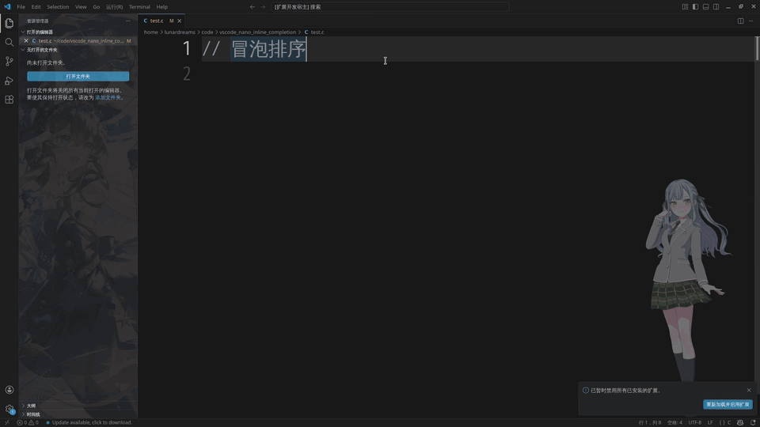

# nano-inline-completion

Minimal VS Code inline completion extension powered by local LLMs via [Ollama](https://ollama.com). Automatically suggests code completions after you stop typing.

Designed for small, fast models like **Qwen2.5-Coder:0.5B** — runs entirely offline on consumer hardware with no GPU required.

<div style="text-align: center;">

</div>

## Demo

<div style="text-align: center;">
  
</div>

## Features

- **Idle-triggered inline completions** — suggests code after you stop typing (default 2s delay)
- **Fill-in-the-Middle (FIM)** support via Ollama native API for prefix-suffix-aware completions
- **Two backends**: Ollama native FIM or OpenAI-compatible chat API

## Prerequisites

- [Ollama](https://ollama.com) installed and running
- A code completion model pulled via Ollama

## Quick Start

```bash
# 1. Pull a small, fast model (runs on CPU)
ollama pull qwen2.5-coder

# 2. Install the extension in VS Code
# 3. Start typing — completions appear after 2 seconds of inactivity
```

The default configuration works out of the box with `qwen2.5-coder` on `ollama-native` backend.

## Configuration

Open VS Code settings (`Ctrl+,`) and search for `nanoInlineCompletion`.

| Setting                                       | Default                       | Description                                                                                    |
| --------------------------------------------- | ----------------------------- | ---------------------------------------------------------------------------------------------- |
| `nanoInlineCompletion.model`                | `qwen2.5-coder`             | Ollama model name                                                                              |
| `nanoInlineCompletion.baseURL`              | `http://localhost:11434/v1` | Ollama API base URL                                                                            |
| `nanoInlineCompletion.apiBackend`           | `ollama-native`             | Backend:`ollama-native` (FIM) or `openai` (chat)                                           |
| `nanoInlineCompletion.maxTokens`            | `64`                        | Max output tokens per completion                                                               |
| `nanoInlineCompletion.idleDelay`            | `2000`                      | Idle time (ms) before triggering completion                                                    |
| `nanoInlineCompletion.trimTrailingBrace`    | `true`                      | Remove trailing `}` from model output to avoid closing the block prematurely                 |
| `nanoInlineCompletion.stripCodeFences`      | `true`                      | Strip markdown code fences (`` ``` ``) and content after them from model output                |
| `nanoInlineCompletion.apiKey`               | `""`                        | API key (only needed for remote OpenAI-compatible endpoints)                                   |
| `nanoInlineCompletion.ignoreFileExtensions` | `[]`                        | File extensions to ignore (e.g.`[".md", ".txt"]`). Completions won't trigger in these files. |

## Recommended Models

| Model                                         | Size | Notes                                  |
| --------------------------------------------- | ---- | -------------------------------------- |
| `qwen2.5-coder` (or `qwen2.5-coder:0.5b`) | 0.5B | Fast, runs on CPU. Default.            |
| `qwen2.5-coder:1.5b`                        | 1.5B | Better quality, still CPU-friendly     |
| `qwen2.5-coder:7b`                          | 7B   | Best quality, needs GPU or lots of RAM |
| `deepseek-coder:1.3b`                       | 1.3B | Good for FIM completions               |
| `codellama:7b-code`                         | 7B   | Good FIM support, larger               |

## Development

```bash
git clone https://github.com/Lacus1025/vscode_nano_inline_completion
cd vscode_nano_inline_completion
npm install
npm run compile
```

Press `F5` in VS Code to launch a new extension development host window.
